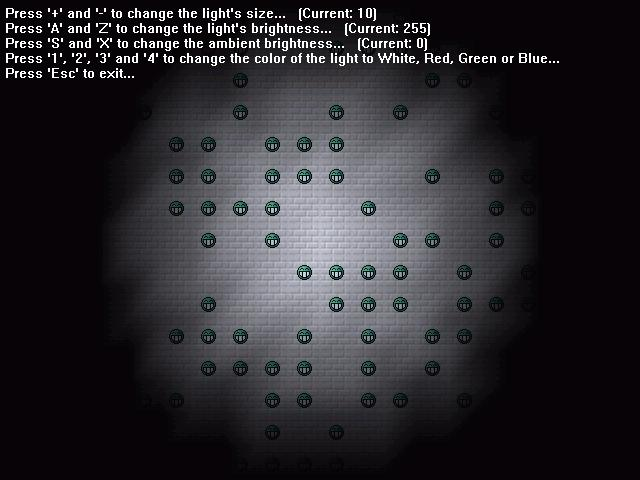



## Direct3D \-\> 2D Part 2, Faking Light\!\!

### Description

After figuring out how to rotate 2D sprites using Direct3D (check my other submissions), I wanted to do lighting. After reading some tutorials I gave up, they all used 3D, while I wanted to do 2D. There are other ways of faking light; making tiles in multiple shades at either design time or run time, but they're limited...  

So here it is: faked light using Direct3D to simulate 2D! It looks great, runs fast (if you've got a 3D card, my P133 with Voodoo 3 could easily run it, although not on software rendering mode), and allows dynamic setting of light brightness and color.   So how does it work? Easy: it sets the color of a vertex (corner) to the brightness of the light at that specific place, after which Direct3D automatically adjusts the texture!   

Some limitations though:  

<ul>

<li> Light might seem choppy when moved (like in the example), but static lights will do much better... the smaller the tiles, the less you'll notice it, but I didn't want to fill the screen with 8x8 sized tiles... 

<li> This won't work with multiple lights or multiple colors of lights, you'll need to adjust some algorithms for that to work. I'm working on this problem, if I finish it, I'll post it here offcourse.

</ul>  

Enjoy, and don't forget to leave comments and vote!   

(You're free to use this code in your own programs/games, but I would appreciate it if you gave me some credit, thanks!)
 
### More Info
 

             |
---                |---
**Submitted On**   |2001-03-02 15:39:08
**By**             |[Mark van Renswoude](https://github.com/Planet-Source-Code/PSCIndex/blob/master/ByAuthor/mark-van-renswoude.md)
**Level**          |Intermediate
**User Rating**    |4.9 (94 globes from 19 users)
**Compatibility**  |VB 4\.0 \(32\-bit\), VB 5\.0, VB 6\.0
**Category**       |[DirectX](https://github.com/Planet-Source-Code/PSCIndex/blob/master/ByCategory/directx__1-44.md)
**World**          |[Visual Basic](https://github.com/Planet-Source-Code/PSCIndex/blob/master/ByWorld/visual-basic.md)
**Archive File**   |[CODE\_UPLOAD15702322001\.zip](https://github.com/Planet-Source-Code/mark-van-renswoude-direct3d-2d-part-2-faking-light__1-21453/archive/master.zip)

